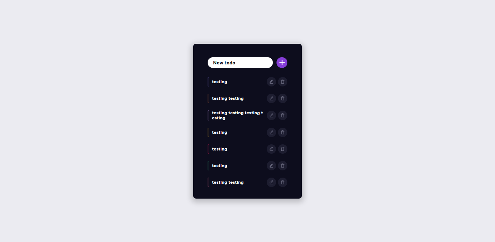

# day-24-in-30-days-of-react 

- this time I made the most standard project out there, an TODO list, but it was good, it helped me understand this filter issue a little more, and edit and remove elements 

# result image  

